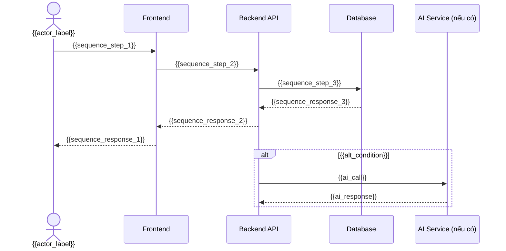

# Flow Diagram: {{requirement_title}}

> **Mã tài liệu:** {{requirement_code}}-FLOW
> **Dự án:** {{project_name}}
> **Cụm chức năng:** {{group_name}}
> **Tác giả:** {{author}}
> **Ngày tạo:** {{created_date}}
> **Phiên bản:** {{version}}
> **Trạng thái:** {{status}}

---

## 1. Tổng Quan

**Mô tả luồng:** {{flow_description}}

**Điểm bắt đầu:** {{start_trigger}}

**Điểm kết thúc:**
- Thành công: {{end_success}}
- Thất bại: {{end_failure}}

**Tác nhân chính:** {{main_actors}}

---

## 2. Luồng Chính (Main Flow)

```mermaid
flowchart TD
    Start([Bắt đầu: {{start_trigger}}])
    --> Step1[{{step_1_label}}]
    --> Decision1{{{decision_1_label}}}

    Decision1 -->|Có| Step2[{{step_2_label}}]
    Decision1 -->|Không| AltFlow1[{{alt_step_1_label}}]

    Step2 --> Step3[{{step_3_label}}]
    Step3 --> Decision2{{{decision_2_label}}}

    Decision2 -->|Thành công| SuccessEnd([Kết thúc: {{end_success}}])
    Decision2 -->|Thất bại| ErrorEnd([Kết thúc: {{end_failure}}])

    AltFlow1 --> AltEnd([Kết thúc: {{alt_end_label}}])

    style Start fill:#22c55e,color:#fff
    style SuccessEnd fill:#3b82f6,color:#fff
    style ErrorEnd fill:#ef4444,color:#fff
    style AltEnd fill:#f59e0b,color:#fff
```

---

## 3. Luồng Thay Thế (Alternative Flows)

### AF-01: {{alt_flow_1_name}}
> **Điều kiện:** {{af1_condition}}

```mermaid
flowchart TD
    AF1Start([AF-01: {{af1_trigger}}])
    --> AF1Step1[{{af1_step_1}}]
    --> AF1End([{{af1_end}}])

    style AF1Start fill:#f59e0b,color:#fff
    style AF1End fill:#6b7280,color:#fff
```

### AF-02: {{alt_flow_2_name}}
> **Điều kiện:** {{af2_condition}}

```mermaid
flowchart TD
    AF2Start([AF-02: {{af2_trigger}}])
    --> AF2Step1[{{af2_step_1}}]
    --> AF2End([{{af2_end}}])

    style AF2Start fill:#f59e0b,color:#fff
    style AF2End fill:#6b7280,color:#fff
```

---

## 4. Luồng Ngoại Lệ (Exception Flows)

```mermaid
flowchart TD
    EXStart([Ngoại lệ])
    --> EXType{Loại lỗi}

    EXType -->|{{exception_1_type}}| EX1Handle[{{exception_1_handle}}]
    EXType -->|{{exception_2_type}}| EX2Handle[{{exception_2_handle}}]

    EX1Handle --> EX1Notify[Thông báo: {{exception_1_message}}]
    EX2Handle --> EX2Notify[Thông báo: {{exception_2_message}}]

    EX1Notify --> EXEnd([Kết thúc lỗi])
    EX2Notify --> EXEnd

    style EXStart fill:#ef4444,color:#fff
    style EXEnd fill:#ef4444,color:#fff
```

---

## 5. Sequence Diagram (Tương Tác Hệ Thống)



---

## 6. Mô Tả Các Bước

| Bước | Tác nhân | Mô tả | Điều kiện rẽ nhánh |
|------|----------|-------|-------------------|
| 1 | {{actor_step_1}} | {{desc_step_1}} | |
| 2 | {{actor_step_2}} | {{desc_step_2}} | {{branch_condition_2}} |
| 3 | {{actor_step_3}} | {{desc_step_3}} | |

---

## 7. Ghi Chú

- {{flow_note_1}}
- {{flow_note_2}}
